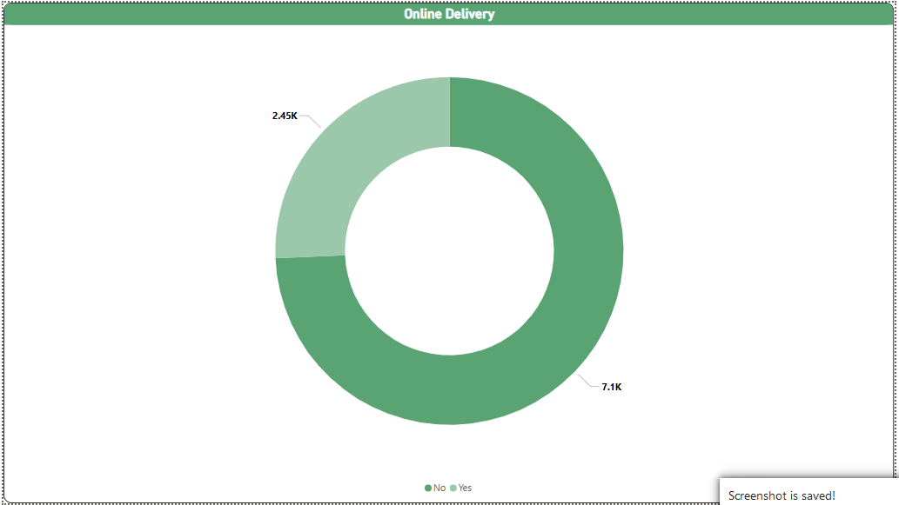

# Zomato Insights Dashboard

A lightweight Power BI dashboard designed to uncover key trends and insights from Zomato restaurant data, enabling quick analysis of cuisine popularity, geographic distribution, and user ratings.

## Project Structure

```
Zomato-Dashboard/
├── dashboard/                       # Power BI source file
│   └── Zomato_Insights_Dashboard.pbix
├── data/                            # Raw and processed data files (e.g., CSV, Excel)
├── exports/                         # Exported reports and visual snapshots (PDF, PNG)
├── README.md                    # This file
└── resources/                       # Supporting assets (images, logos)
```

## Getting Started

1. **Prerequisite**: Install Microsoft Power BI Desktop.
2. Clone or download the repository:

   ```bash
   git clone https://github.com/Xenaquas/Zomato-Dashboard.git
   ```
3. Open `dashboard/Zomato_Insights_Dashboard.pbix` in Power BI Desktop.
4. Refresh data or connect to your own Zomato dataset.
5. Explore pre-built report pages:

   * Overview: High-level KPIs (total restaurants, average ratings).
   * Cuisine Analysis: Popular cuisines by city.
   * Rating Distribution: User rating trends.
   * Geographic Map: Restaurant locations on a map.

## Usage

* Interact with slicers and filters to drill down by city, cuisine, price range, and ratings.
* Export visuals or publish to Power BI Service for sharing.

## Media
<p align="center"> 
<br> 
 <br>
 <br>
 <br>
 <br>
 <br>
</p> 

---
## Contact

For questions or feedback, please open an issue or reach out at `your.email@example.com`.
